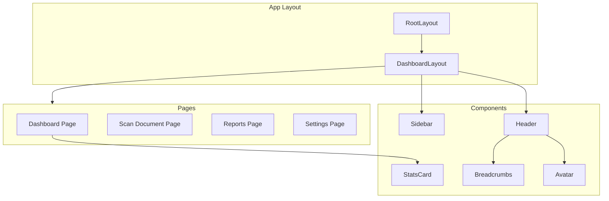

# FraudGuard UK - Phase 1 Implementation Plan

## Overview

Initialize the FraudGuard UK Next.js application with TypeScript, Tailwind CSS, and Shadcn UI, then build the core app shell (sidebar, header) and dashboard view with a professional "Corporate & Cool" aesthetic.

## Task Checklist

- [ ] Initialize Next.js project with TypeScript, Tailwind, ESLint, App Router
- [ ] Install and configure Shadcn UI with Slate theme and CSS variables
- [ ] Install lucide-react and next-themes dependencies
- [ ] Remove default Next.js boilerplate and styling
- [ ] Create Sidebar component with navigation links and icons
- [ ] Create Header component with breadcrumbs and avatar
- [ ] Create DashboardLayout component to wrap pages
- [ ] Build Dashboard page with welcome section and stats cards
- [ ] Create placeholder pages for Scan, Reports, and Settings
- [ ] Test app runs without errors and matches design aesthetic

---

## Architecture Overview



---

## Step 1: Initialize Next.js Project

Run the following command in the workspace root:

```bash
npx create-next-app@latest . --typescript --tailwind --eslint --app --src-dir --import-alias "@/*"
```

Options to select:

- TypeScript: Yes
- ESLint: Yes  
- Tailwind CSS: Yes
- `src/` directory: Yes
- App Router: Yes
- Import alias: `@/*`

---

## Step 2: Install and Configure Shadcn UI

### 2.1 Initialize Shadcn

```bash
npx shadcn@latest init
```

Configuration choices:

- Style: Default
- Base color: **Slate**
- CSS variables: **Yes** (enables dark mode)

### 2.2 Install Required Components

```bash
npx shadcn@latest add button card avatar separator
```

### 2.3 Install Lucide React Icons

```bash
npm install lucide-react
```

---

## Step 3: Clean Up Boilerplate

Remove default Next.js styling from:

- `src/app/page.tsx` - Replace with Dashboard content
- `src/app/globals.css` - Keep only Tailwind directives and Shadcn theme variables

---

## Step 4: Create the App Shell

### 4.1 File Structure

```
src/
├── app/
│   ├── layout.tsx          # Root layout with fonts
│   ├── page.tsx            # Dashboard (home)
│   ├── scan/
│   │   └── page.tsx        # Scan Document page (placeholder)
│   ├── reports/
│   │   └── page.tsx        # Reports page (placeholder)
│   └── settings/
│       └── page.tsx        # Settings page (placeholder)
├── components/
│   ├── layout/
│   │   ├── sidebar.tsx     # Main sidebar navigation
│   │   ├── header.tsx      # Top header bar
│   │   └── dashboard-layout.tsx  # Layout wrapper
│   ├── dashboard/
│   │   └── stats-card.tsx  # Reusable stats card
│   └── ui/                 # Shadcn components (auto-generated)
└── lib/
    └── utils.ts            # Shadcn utility (auto-generated)
```

### 4.2 Sidebar Component

Location: `src/components/layout/sidebar.tsx`

Features:

- Fixed width (w-64)
- Dark background (`bg-slate-900` or `bg-zinc-900`)
- Logo/brand area at top
- Navigation links with Lucide icons:
  - `LayoutDashboard` - Dashboard
  - `ScanLine` - Scan Document
  - `FileBarChart` - Reports
  - `Settings` - Settings
- Active state highlighting
- Hover transitions

### 4.3 Header Component

Location: `src/components/layout/header.tsx`

Features:

- Sticky top bar
- Breadcrumbs on the left (Home > Current Page)
- User avatar placeholder on the right (using Shadcn Avatar)
- Border bottom for separation

### 4.4 Dashboard Layout

Location: `src/components/layout/dashboard-layout.tsx`

Structure:

```tsx
<div className="flex h-screen">
  <Sidebar />
  <div className="flex-1 flex flex-col">
    <Header />
    <main className="flex-1 overflow-auto bg-slate-50 dark:bg-slate-950 p-6">
      {children}
    </main>
  </div>
</div>
```

---

## Step 5: Create Dashboard View

Location: `src/app/page.tsx`

### 5.1 Welcome Section

- Greeting text: "Welcome back"
- Subtitle: "Here's an overview of your document scanning activity"

### 5.2 Stats Cards Grid

Create 4 stats cards using Shadcn Card component:

| Card Title | Icon | Value | Subtext |
|------------|------|-------|---------|
| Documents Scanned | FileText | 0 | Total scans this month |
| Risks Detected | AlertTriangle | 0 | Flagged documents |
| Verified Documents | CheckCircle | 0 | Passed verification |
| Pending Review | Clock | 0 | Awaiting review |

Layout: `grid grid-cols-1 md:grid-cols-2 lg:grid-cols-4 gap-6`

---

## Step 6: Dark Mode Support

Add a theme provider using `next-themes`:

```bash
npm install next-themes
```

- Wrap app in ThemeProvider
- Add theme toggle button in header (optional for Phase 1)
- Default to system preference

---

## Step 7: Typography (Inter Font)

Configure Inter font in `src/app/layout.tsx` using `next/font/google`:

```tsx
import { Inter } from 'next/font/google'

const inter = Inter({ subsets: ['latin'] })
```

---

## Final Deliverables

After implementation, the app will have:

1. **Professional sidebar** with navigation to 4 sections
2. **Header** with breadcrumbs and user avatar
3. **Dashboard** with welcome message and 4 stats cards
4. **Dark mode ready** with Slate color scheme
5. **Responsive layout** that works on desktop and tablet
6. **Clean codebase** with no default Next.js branding
